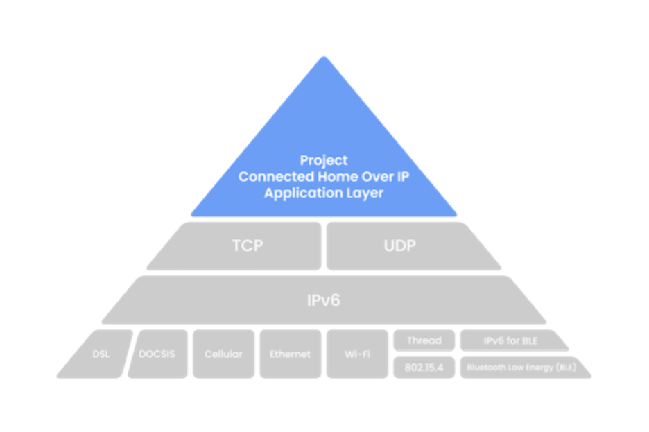
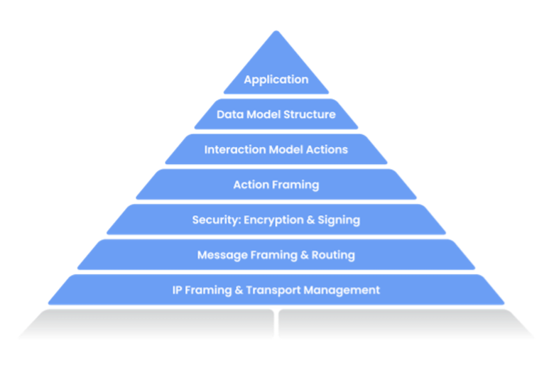
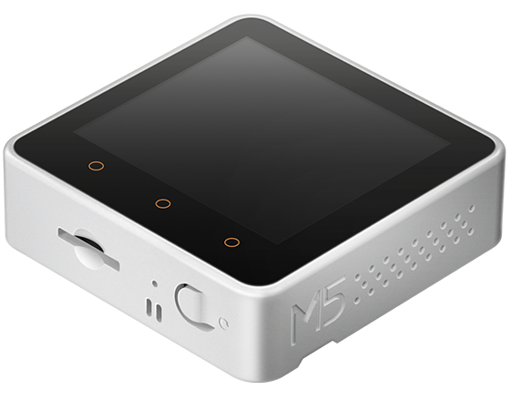
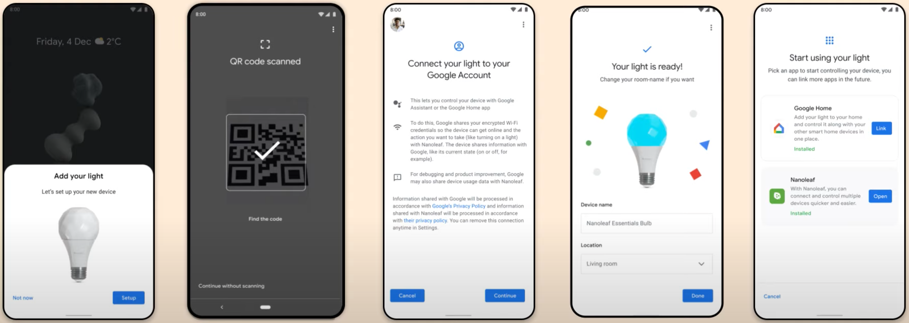
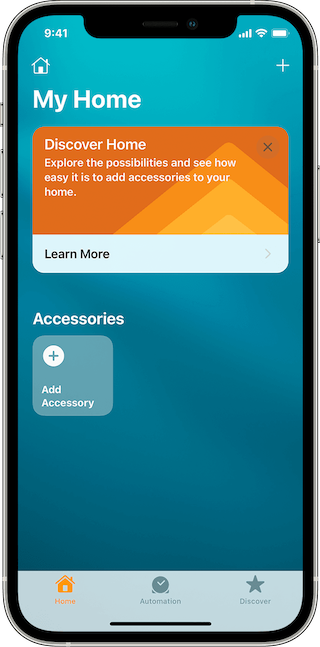

# Matter


BY


## Objective

- Why [Matter](https://buildwithmatter.com)?
- Core concepts
- Build and test on Linux
- Build on macOS and test on ESP32
- Device commissioning / setup
- Zigbee Cluster Library Specification
- Contributing to the project

## Why Matter?

- Simple, [interoperable](https://youtu.be/v_285vCHifw), reliable, and [secure](https://www.youtube.com/watch?v=Q4jhK-IBKuI)
- [Promoted by](https://csa-iot.org/members/) industry leading device manufacturers
- Open [specification](https://github.com/CHIP-Specifications/connectedhomeip-spec) and [implementation](https://github.com/project-chip/connectedhomeip)
- Apache-2 licensed royalty-free source code
- Devices available [sometime in 2022](https://www.cepro.com/news/matter-smart-home-standard-timeline-2022/)
- Preliminary support available on [Android 12](https://developers.google.com/home/matter) and [iOS 15](https://developer.apple.com/documentation/homekit/)

---

### Core concepts

Matter                      | HomeKit            | Zigbee
--------------------------- | ------------------ | --------------
Attribute                   | Characteristic     | Attribute
Binding                     | Event subscription | Binding
Cluster                     | Services           | Cluster
Commissioning / Rendezvous  | Pairing            | Association
Controller / Commissioner   | Admin              | Coordinator
Device or Node              | Accessory          | Device or Node
Endpoint                    | Profile            | Endpoint
Fabric                      | Network            | Network

---

### Internet Protocols



---

### Architecture



---

## How to use it today?

- Start by reading the docs at [https://github.com/project-chip/connectedhomeip](https://github.com/project-chip/connectedhomeip)
- Try it out with Linux on a Raspberry Pi
- Try it out with an embedded device such as ESP32

---

### Code Repository

- Top level

  ```text
  BUILD.gn
  CONTRIBUTING.md    
  README.md
  build
  docs
  examples
  gn_build.sh
  scripts
  src
  third_party
  zzz_generated
  ```

---

### Code Repository - src

- `/src`

  ```text
  BUILD.gn
  access
  android
  app
  ble
  controller    
  credentials    
  crypto
  darwin
  include
  inet
  messaging
  platform
  protocols
  transport
  ```

---

### Code Repository - examples

- `/examples`

  ```text
  all-clusters-app
      all-clusters-common    
      esp32
      linux
  bridge-app
  chip-tool
  chip-tool-darwin
  common
  door-lock-app
  light-switch-app
  platform
  ```

---

### Supported Platforms

- [ESP32](https://youtu.be/bS9Ch7k_GK0)
- FreeRTOS
- Linux
- Mbed OS
- [nRF Connect](https://youtu.be/kdMJQFDRoss)
- [NXP](https://youtu.be/PQyahv2m0p4)
- Tizen
- Zephyr

---

### Linux Device Development

- Build and test on a Raspberry Pi 4


---

#### Install build toolchain

- On Raspbian and similar

  ```bash
  sudo apt install git gcc g++ python pkg-config \
    libssl-dev libdbus-1-dev libglib2.0-dev \
    ninja-build python3-venv python3-dev unzip
  ```

---

#### Build and run all-clusters-app

- Build steps

  ```bash
  git clone --recurse-submodules \
    https://github.com/project-chip/connectedhomeip
  cd connectedhomeip
  unalias python
  source ./scripts/bootstrap.sh
  source ./scripts/activate.sh
  cd examples/all-clusters-app/linux
  gn gen out/debug
  ninja -C out/debug
  # Delete network
  ./out/debug/chip-all-clusters-app --wifi
  ```

---

### ESP32 Device Development

- Build on Linux or macOS and test on [M5STACK](https://m5stack.com) Core 2



---

#### Install ESP-IDF

- Installation ESP-IDF SDK

  ```bash
  git clone https://github.com/espressif/esp-idf.git
  cd esp-idf
  git checkout v4.4.1
  git submodule update --init
  ./install.sh
  source ./export.sh
  ```

---

#### Build and run all-clusters-app on ESP32

- Assuming you've cloned source code repo
- Build steps

  ```bash
  cd connectedhomeip
  unalias python
  source ./scripts/bootstrap.sh
  source ./scripts/activate.sh
  cd examples/all-clusters-app/esp32
  rm sdkconfig
  idf.py -D 'SDKCONFIG_DEFAULTS=sdkconfig_m5stack.defaults' build
  idf.py -p /dev/cu.usbserial-022D45D6 erase_flash flash monitor
  ```

- Quit serial monitor using `Ctrl+]`

---

### chip-tool

- Command line tool to commission and interact with devices
- At least five different flavors - Android, iOS, Posix, Darwin, and Python

---

#### Install dependencies to build chip-tool on macOS

- Install dependencies using Homebrew

  ```bash
  brew install openssl pkg-config
  cd /usr/local/lib/pkgconfig
  ln -s ../../Cellar/openssl@1.1/1.1.1n/lib/pkgconfig/* .
  ```

---

#### Build and run chip-tool on macOS

- Assuming you've cloned source code repo
- Build steps

  ```bash
  cd connectedhomeip
  unalias python
  source ./scripts/bootstrap.sh
  source ./scripts/activate.sh
  cd examples/chip-tool
  gn gen out/debug
  ninja -C out/debug
  ./out/debug/chip-tool onoff toggle 1 1
  ```

---

### Commissioning

- Configures device into a Matter fabric

- Pair device with multiple controllers / admins

- Commissioning over BLE/Wi-Fi using `chip-tool`
  
  ```bash
  ./out/debug/chip-tool pairing ble-wifi \
    1 ssid "password" \
    20202021 3840
  ```

---

### Device Setup Flow on Android 12

[](https://youtu.be/3IKmgnS6FDg?t=518)

---

### Device Commissioning on iOS 15

- A hub device such as Apple TV 4K is needed
- A Matter profile needs to be installed on iOS and hub

[](https://developer.apple.com/videos/play/wwdc2021/10298/)

---

### Pair device with another controller

- Open commissioning window on device

  ```bash
  ./out/debug/chip-tool pairing \
    open-commissioning-window \
    1 1 400 2000 3840
  ```

- Use `onnetwork` pairing to discover devices and pair with first device found

  ```bash
  ./out/debug/chip-tool pairing onnetwork 0 20202021
  ```

- [Android](https://www.youtube.com/watch?v=ayEYlJUfFlI) and iOS enable similar functionality

---

### Read attributes using chip-tool

- Try

  ```bash
  ./out/debug/chip-tool onoff read on-off 1 1
  ./out/debug/chip-tool pressuremeasurement read measured-value 1 1
  ./out/debug/chip-tool relativehumiditymeasurement read measured-value 1 1
  ./out/debug/chip-tool temperaturemeasurement read measured-value 1 1
  ```

  ```log
  CHIP: [DMG] 				}
  CHIP: [DMG] 					
  CHIP: [DMG] 					Data = -32768, 
  CHIP: [DMG] 				DataVersion = 0x0,
  CHIP: [DMG] 			},
  ```

---

### Write attributes using chip-tool

- Try

  ```bash
  ./out/debug/chip-tool onoff write on-time 5 1 1
  ./out/debug/chip-tool onoff read on-time 1 1
  ```

  ```log
  CHIP: [DMG] 				}
  CHIP: [DMG] 					
  CHIP: [DMG] 					Data = 5, 
  CHIP: [DMG] 				DataVersion = 0x0,
  CHIP: [DMG] 			},
  ```

---

### Send commands using chip-tool

- Try

  ```bash
  ./out/debug/chip-tool onoff toggle 1 1
  ./out/debug/chip-tool onoff read on-off 1 1
  ```

  ```log
  CHIP: [DMG] 				}
  CHIP: [DMG] 					
  CHIP: [DMG] 					Data = true, 
  CHIP: [DMG] 				DataVersion = 0x0,
  CHIP: [DMG] 			},
  ```

---

### Configure Device Model using ZAP Tool

- Endpoints are defined in a `.zap` file which then generates code and static structures for the [data model](https://developers.home.google.com/matter/primer/device-data-model)

- Run [Zigbee Cluster Configurator](https://github.com/project-chip/zap)

  ```bash
  brew install nvm
  nvm use stable
  cd connectedhomeip
  cd third-party/zap/repo
  npm i
  npm run zap
  ```

- See Zigbee Cluster Library Specification

---

### Contributing to Matter

- Submit bugs and features to [https://github.com/project-chip/connectedhomeip/issues](https://github.com/project-chip/connectedhomeip/issues)

- Run automated test suite using [act](https://github.com/nektos/act)

  ```bash
  brew install act
  act -j test_suites_linux
  ```

- Run tests on device using chip-tool

  ```bash
  ./out/debug/chip-tool tests TestCluster --nodeId 1
  ```

- Submit pull request via GitHub for maintainers to review and merge

---

### Wrap-up

- Questions?
- Thanks!
