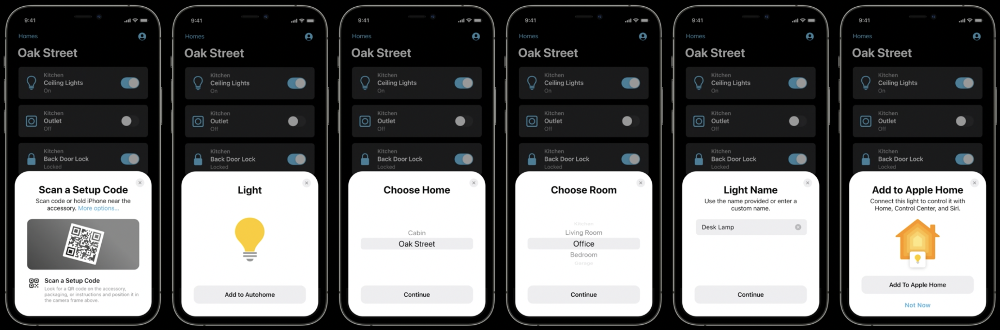

# Matter

## Objective

- Why [Matter](https://buildwithmatter.com)?
- When will it be available?
- How to use it today?

## Why Matter?

- Why smart home?
- Limited smart home potential without interoperable devices
- Matter is driven by industry leading device manufacturers
- Matter implementation is open source and free of royalties
- Matter weaves together existing standards and fills in the blanks

---

### Internet Protocols


---

## When will it be available?

- Devices that support Matter [pushed to sometime in 2022](https://www.cepro.com/news/matter-smart-home-standard-timeline-2022/)
- Preliminary support available on [Android 12](https://developers.google.com/home/matter) and [iOS 15](https://developer.apple.com/documentation/homekit/)
- Wide adoption is expected
  
  

## How to use it today?

- Start by reading the docs at [https://github.com/project-chip/connectedhomeip](https://github.com/project-chip/connectedhomeip)
- Try it out in Linux on a Raspberry Pi
- Try it out on an embedded device such as ESP32

---

### Core concepts

Matter                      | HomeKit            | Zigbee
--------------------------- | ------------------ | --------------
Attribute                   | Characteristic     | Attribute
Binding                     | Event subscription | Binding
Cluster                     | Services           | Cluster
Commissioning / Rendezvous  | Pairing            | Association
Controller / Commissioner   | Admin              | Coordinator
Device or Node              | Accessory          | Device or Node
Endpoint                    | Profile            | Endpoint
Fabric                      | Network            | Network

---

### Architecture


---

### Code Repository

:::: {.columns}

::: {.column width="50%"}

```text
BUILD.gn
CONTRIBUTING.md
build
build_overrides
docs
examples
    all-clusters-app
        all-clusters-common
        esp32
        linux
    bridge-app
    chip-tool
    common
    platform
        esp32
        linux
integrations
```

:::

::: {.column width="50%"}

```text
scripts
    activate.sh -> bootstrap.sh
    bootstrap.sh
src
    include
    lib
    platform
        ESP32
        Linux
    protocols
    system
    tools
        chip-cert
    transport
third_party
    pigweed
    zap
zzz_generated
```

:::

::::

---

### Supported development platforms

:::: {.columns}

::: {.column width="50%" text-align="left"}

- Embedded
  - ESP32
  - FreeRTOS
  - Linux
  - mbed
  - nrfconnect
  - nxp
  - Tizen
  - Zephyr

:::

::: {.column width="50%"}

- Mobile
  - Android
  - iOS
- Desktop
  - Linux
  - macOS
  - Windows

:::

::::

---

### Linux Device Firmware Development

- Build and test on a Raspberry Pi 4

- Install toolchain

  ```bash
  sudo apt-get install git gcc g++ python pkg-config \
    libssl-dev libdbus-1-dev libglib2.0-dev \
    ninja-build python3-venv python3-dev unzip
  ```

- Build and run all-clusters-app

  ```bash
  git clone --recurse-submodules \
    https://github.com/project-chip/connectedhomeip
  cd connectedhomeip
  unalias python
  source ./scripts/bootstrap.sh
  source ./scripts/activate.sh
  cd examples/all-clusters-app/linux
  gn gen out/debug
  ninja -C out/debug
  # Delete network
  ./out/debug/chip-all-clusters-app --wifi
  ```

---

### ESP32 Device Firmware Development

- Build on macOS and test on [M5STACK](https://m5stack.com) Core 2

- Install ESP-IDF
  
  ```bash
  git clone https://github.com/espressif/esp-idf.git
  cd esp-idf
  git checkout v4.3
  git submodule update --init
  ./install.sh
  source ./export.sh
  ```

- Build and run all-clusters-app example on device

  ```bash
  cd connectedhomeip
  unalias python
  source ./scripts/bootstrap.sh
  source ./scripts/activate.sh
  cd examples/all-clusters-app/esp32
  idf.py build
  idf.py -p /dev/cu.usbserial-022D45D6 erase_flash \
    flash monitor
  ```

---

### chip-tool

Command line tool to commission and interact with devices

Install dependencies for macOS

```bash
brew install openssl pkg-config
cd /usr/local/lib/pkgconfig
ln -s ../../Cellar/openssl@1.1/1.1.1g/lib/pkgconfig/* .
```

Build and run

```bash
cd connectedhomeip
unalias python
source ./scripts/bootstrap.sh
source ./scripts/activate.sh
cd examples/chip-tool
gn gen out/debug
ninja -C out/debug
./out/debug/chip-tool onoff toggle 1 1
```

---

### Commissioning

- Configures device into a Matter fabric

- Pair device with multiple controllers

- Commissioning over BLE/Wi-Fi using `chip-tool`
  
  ```bash
  chip-tool pairing ble-wifi \
    ssid "password" \
    0 20202021 3840
  ```

---

### Commissioning on Android 12

[]((https://www.youtube.com/watch?v=I_hY90Xu3xg))

---

### Commissioning on iOS 15

:::: {.columns}

::: {.column width="60%"}

- Open the Home app and tap Add Accessory or Add
- Tap Add Accessory
- Use the camera on your iPhone, iPad, or iPod touch to scan the QR code on the
  accessory or accessory documentation
- When your accessory appears, tap it. If asked to Add Accessory to Network, tap
  Allow.
- Name your accessory and assign it to a room to help you identify it in the
  Home app and control it with Siri
- Tap Next, then tap Done.

:::

::: {.column width="40%"}

[]((https://support.apple.com/en-us/HT204893))

:::

::::

---

### Pair with another controller

Open commissioning window on device

```bash
./out/debug/chip-tool pairing \
  open-commissioning-window \
  1 1 400 2000 3840
```

Use `onnetwork` pairing to discover devices and pair with first device found

```bash
./out/debug/chip-tool pairing onnetwork 0 20202021
```

---

### Read attributes using chip-tool

```bash
chip-tool onoff read on-off 1 1
chip-tool pressuremeasurement read measured-value 1 1
chip-tool relativehumiditymeasurement read measured-value 1 1
chip-tool temperaturemeasurement read measured-value 1 1
```

```log
CHIP: [DMG] 				}
CHIP: [DMG] 					
CHIP: [DMG] 					Data = -32768, 
CHIP: [DMG] 				DataVersion = 0x0,
CHIP: [DMG] 			},
```

---

### Write attributes using chip-tool

```bash
chip-tool onoff write on-time 5 1 1
chip-tool onoff read on-time 1 1
```

```log
CHIP: [DMG] 				}
CHIP: [DMG] 					
CHIP: [DMG] 					Data = 5, 
CHIP: [DMG] 				DataVersion = 0x0,
CHIP: [DMG] 			},
```

---

### Send commands using chip-tool

```bash
chip-tool onoff toggle 1 1
chip-tool onoff read on-off 1 1
```

```log
CHIP: [DMG] 				}
CHIP: [DMG] 					
CHIP: [DMG] 					Data = true, 
CHIP: [DMG] 				DataVersion = 0x0,
CHIP: [DMG] 			},
```

---

### View device configuration using ZAP Tool

- Endpoints are defined (along with the clusters and attributes they contain) in
  a `.zap` file which then generates code and static structures to define the endpoints

- Run Zigbee Cluster Configurator

  ```bash
  brew install nvm
  nvm use stable
  cd connectedhomeip
  cd third-party/zap/repo
  npm i
  npm run zap
  ```

- Open `examples/all-clusters-app/all-clusters-common/all-clusters-app.zap`

- Data definition specified in Zigbee Cluster Library Specification

---

### Contributing to Matter

- Read CONTRIBUTING.md

- Submit bugs and features to https://github.com/project-chip/connectedhomeip/issues

- Change code

- Run automated test suite on host using [act](https://github.com/nektos/act) e.g.

  ```bash
  brew install act
  act -j test_suites_linux
  ```

- Run test on device using chip-tool

  ```bash
  chip-tool tests TestCluster 1
  ```

- Submit pull request via GitHub for maintainers to review and merge
